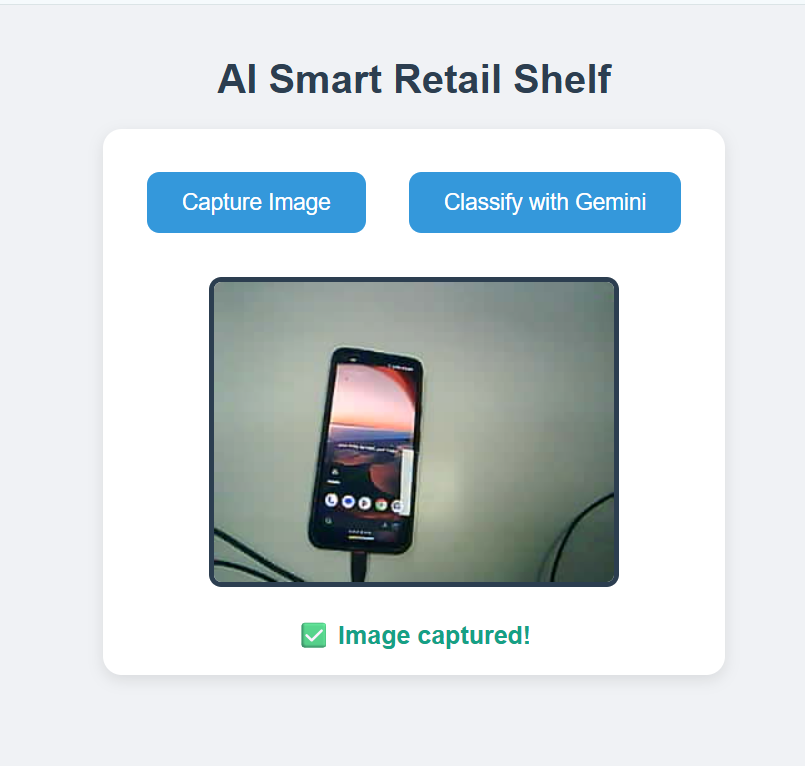
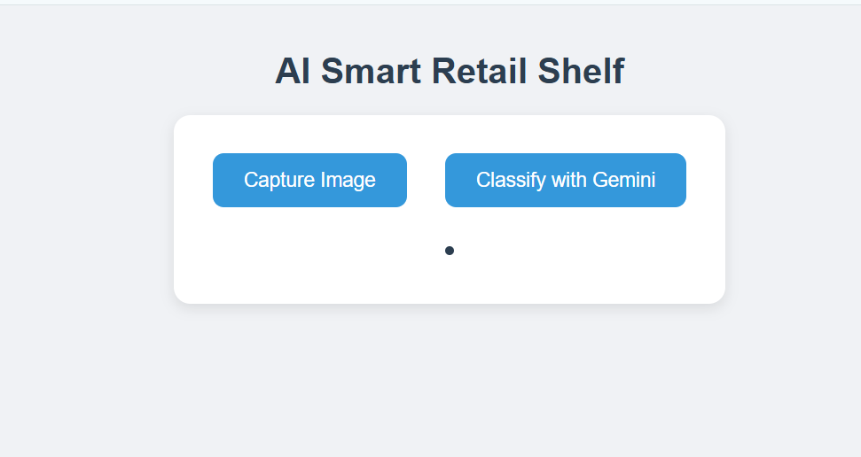

# 🛒 AI Smart Retail Shelf (XIAO ESP32-S3 + Gemini)

This project demonstrates how to build a **smart retail shelf** using the **XIAO ESP32-S3** with camera support and Google's **Gemini API**.  
The ESP32-S3 captures images via a simple web interface, sends them to Gemini for analysis, and returns product counts or descriptions in real-time.



---

## ✨ Features

- 📷 Capture images directly from ESP32-S3 camera
- 🌐 Web-based UI (no app required)
- 🧠 AI-powered classification with **Gemini API**
- 🔢 Counts multiple products on a retail shelf
- 💡 Extendable for custom prompts and AI tasks
- ⚡ Lightweight — runs on the **XIAO ESP32-S3** board

---

## 🚀 Getting Started

### 1. Hardware Required
- [XIAO ESP32-S3](https://wiki.seeedstudio.com/xiao_esp32s3_getting_started/)  
- OV2640 camera module (compatible with XIAO ESP32-S3)  
- USB-C cable  
- WiFi connection  

### 2. Software Required
- [Arduino IDE](https://www.arduino.cc/en/software) or [PlatformIO](https://platformio.org/)  
- ESP32 board support package installed  
- Google Gemini API key ([Get it here](https://aistudio.google.com/apikey))  https://aistudio.google.com/apikey

### 3. Setup
1. Clone this repository:
   ```bash
   git clone https://github.com/sushildwivedi27/esp32cam_gemini_ai.git
   cd esp32cam_gemini_ai
Open the project in Arduino IDE.

Update the following in the code:

cpp
Copy code
const char* ssid = "YOUR_WIFI_SSID";
const char* password = "YOUR_WIFI_PASSWORD";
String apiKey = "YOUR_GEMINI_API_KEY";
Select XIAO ESP32-S3 as the board and upload.

🌐 How It Works
ESP32-S3 starts a local web server (shown in Serial Monitor).
Example: http://192.168.1.45/

Open the page in a browser — you’ll see:

Capture Image → grabs a live snapshot from camera

Classify with Gemini → sends snapshot to Gemini API and shows response

Results are displayed in the browser:

css
Copy code
🧠 Gemini says: {
    "Coke Bottle": 5,
    "Chips Packet": 3,
    "Biscuits Pack": 2
}
🛠️ Configuration
Camera Frame Size: FRAMESIZE_QVGA (320×240, stable for web)

JPEG Quality: 12 (adjustable)

Classification Prompt: Modify userPrompt in code for custom tasks

📸 Demo

⚡ Example Prompt
You can customize the AI behavior by editing userPrompt:


String userPrompt = "Please analyze the given image and provide a count of each product in the following format:\n"
                    "{\n"
                    "'Product 1 Name': number of 'Product 1',\n"
                    "'Product 2 Name': number of 'Product 2'\n"
                    "}\n";
🧩 Future Improvements
 Add support for higher resolutions

 Use streaming video + continuous classification

 Store logs of counts in SD card / database

 Edge AI (TinyML) without internet dependency

